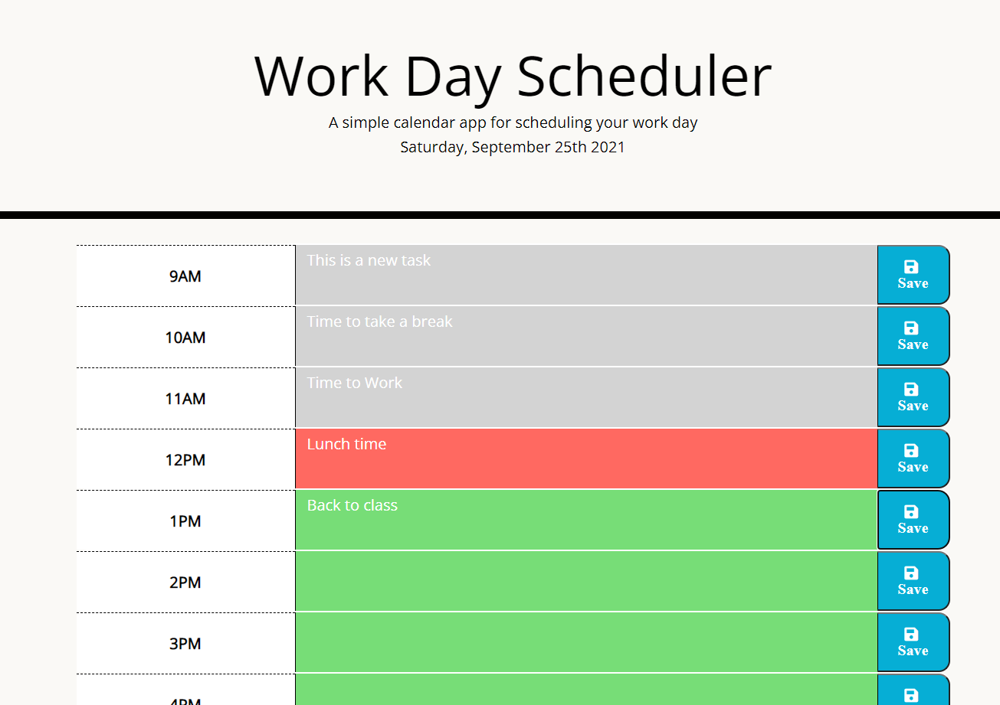

# workingWorkPlanner-5
05 Third-Party APIs: Work Day Scheduler

Link to Github Application: To be added!

Link to Githut Repository: https://github.com/azuryte5/workingWorkPlanner-5

##Project Overview:

For this assignment we were given start code and had to make use of a pre-made CSS style sheet and code a javascript for functionality.

I tried to include learning of jquery into the code and found some creative ways to put together desired functionality. When the page is loaded, the date is presented and user can add events, routines into a textarea and click save to view content later. When page reloads, information is retained and presented for further use. 

Line 23-31 of Javascript decides which time blocks to turn red,green or grey. 

I had a bug where the program fails to run after work hours and chose to add line 17 to prevent program breaking. I was beginning to refactor the code to get all content to be contained in the count array but I was hoping to complete Challenge 6 before Project 1. 

I kept some of my old code, to show where I cleaned up some code. Notably the buttons and Load States.

* User Story
AS AN employee with a busy schedule
I WANT to add important events to a daily planner
SO THAT I can manage my time effectively

* Acceptance Criteria
GIVEN I am using a daily planner to create a schedule
[✔️ ] WHEN I open the planner
THEN the current day is displayed at the top of the calendar
[✔️ ] WHEN I scroll down
THEN I am presented with timeblocks for standard business hours
[✔️ ] WHEN I view the timeblocks for that day
THEN each timeblock is color coded to indicate whether it is in the past, present, or future
[✔️] WHEN I click into a timeblock
THEN I can enter an event
[✔️] WHEN I click the save button for that timeblock
THEN the text for that event is saved in local storage
[✔️ ] WHEN I refresh the page
THEN the saved events persist

© 2021 Trilogy Education Services, LLC, a 2U, Inc. brand. Confidential and Proprietary. All Rights Reserved.